# 호두 랜딩 페이지

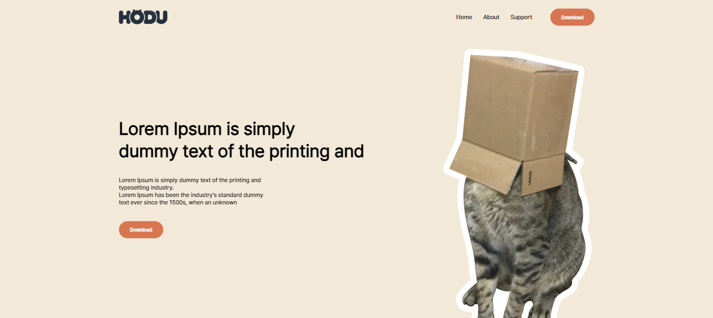
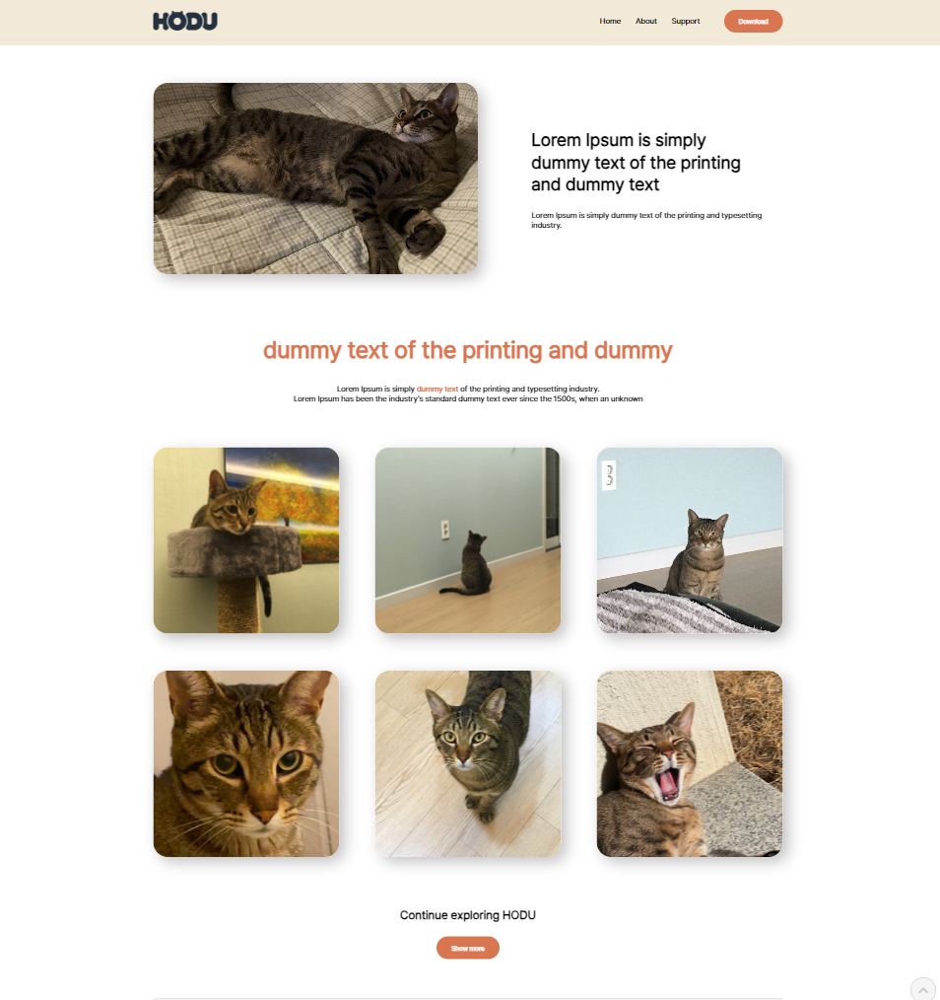
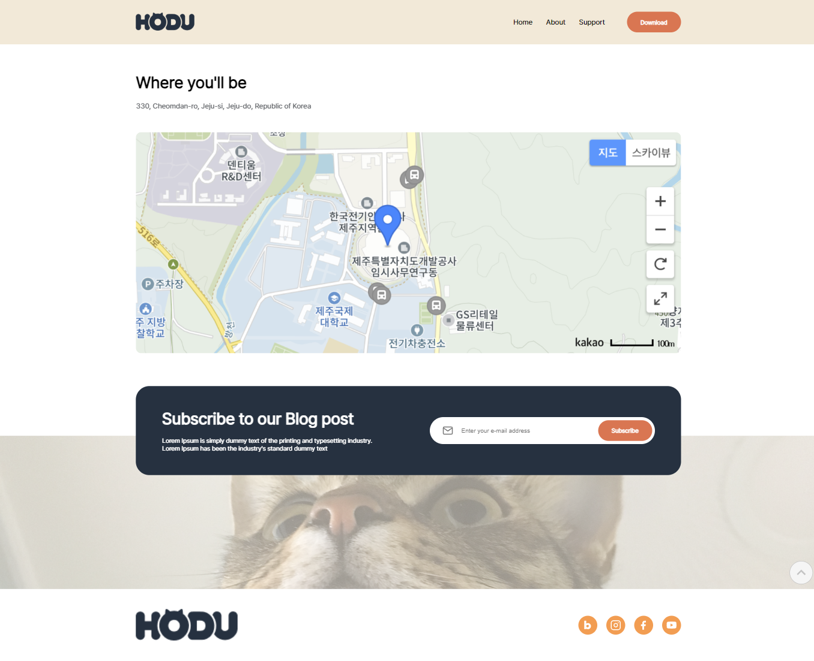

## 1. 목표와 기능

### 1-1. 목표

- HTML, CSS, Javascript 개발 실습
- 반응형 UI 설계

### 1-2. 기능

- 다양한 고양이 사진을 확인할 수 있는 블로그 페이지
- 웹, 모바일 환경에 반응형으로 동작하는 웹 페이지
- 모달 창으로 블로그를 구독할 이메일 전송
- 애니메이션이 적용된 사이드 바
- 최상단으로 스크롤 이동하는 스크롤 탑 버튼

## 2. 개발 환경

**Frontend**

- HTML5
- CSS3
- JavaScript

**IDE**

- Visual Studio Code

**Code Style**

- Prettier

## 3. 요구사항 명세

1. 디자인에 맞게 웹 페이지 구현을 합니다.
2. 모바일 화면도 고려하여 페이지 구현을 합니다.
3. 스크롤시 헤더가 고정되게 합니다. (단, 처음에는 고정된 상태가 아닙니다.)
4. 스크롤 탑 버튼을 구현합니다.
   - 스크롤 탑 버튼은 스크롤시 나타납니다.
   - 스크롤 탑 버튼은 푸터 아래로 내려가지 않습니다.
   - 스크롤 탑 버튼을 누르면 스크롤이 최상단으로 올라갑니다. (단, 부드럽게 올라가야 합니다.)
5. 구독하기 모달창
   - 이메일을 입력하고 `Subscribe` 버튼을 클릭하면 모달창이 나타납니다.
   - 이메일 유효성 검사를 진행해야 합니다. (값이 들어가지 않거나 이메일 형식이 유효하지 않으면 alert 창으로 경고 문구가 떠야합니다.)
   - 이메일이 잘 입력되었다면 모달창이 뜹니다. 이때 모달창의 `OK! I love HODU` 버튼을 클릭하면 form이 제출되고 모달창이 닫힙니다.

## 4. 프로젝트 구조와 개발 일정

### 4-1. 프로젝트 구조

```bash
project-name/
│
├── assets/
│   ├── images/
│   └── fonts/
│
├── css/
│   ├── base.css
│   ├── mobile.css
│   ├── reset.css
│   └── web.css
│
├── js/
│   ├── events.js
│   └── utils.js
│
├── index.html
├── README.md
└── .prettierrc
```

### 4-2. 개발 일정(WBS)

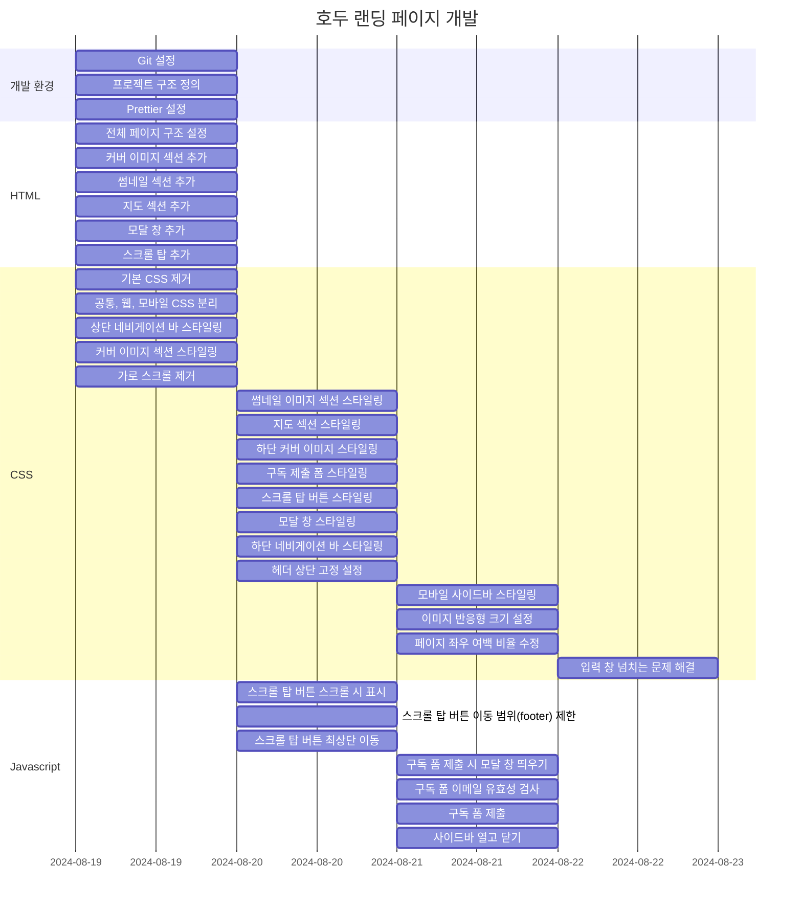

## 5. 화면 설계

### 커버 화면 - 웹


### 커버 화면 - 모바일

<div style="display: flex; justify-content: start; gap: 1%;">
    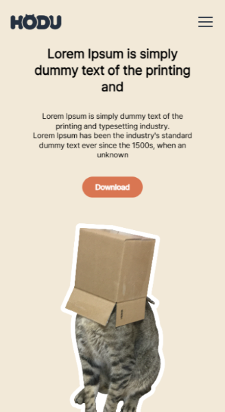
    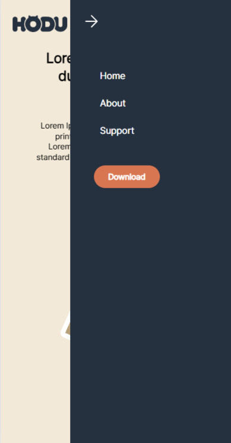
</div>

### 썸네일 화면 - 웹


### 썸네일 화면 - 모바일

<div style="display: flex; justify-content: start; gap: 1%;">
    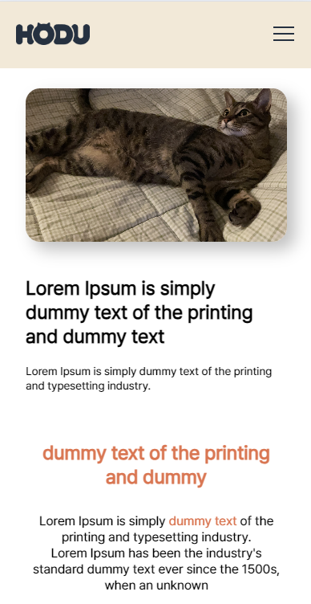
    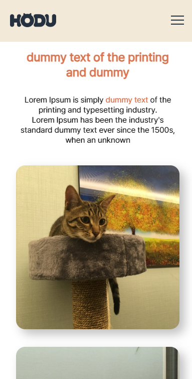
    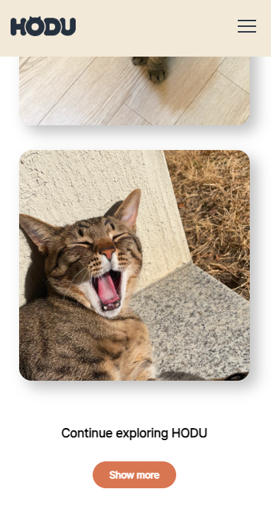
</div>

### 지도 화면 - 웹


### 지도 화면 - 모바일

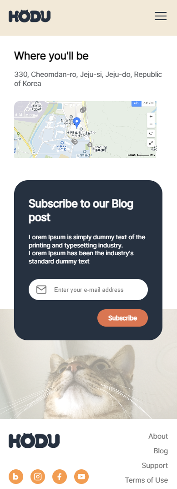

### 구독 모달 창 - 웹

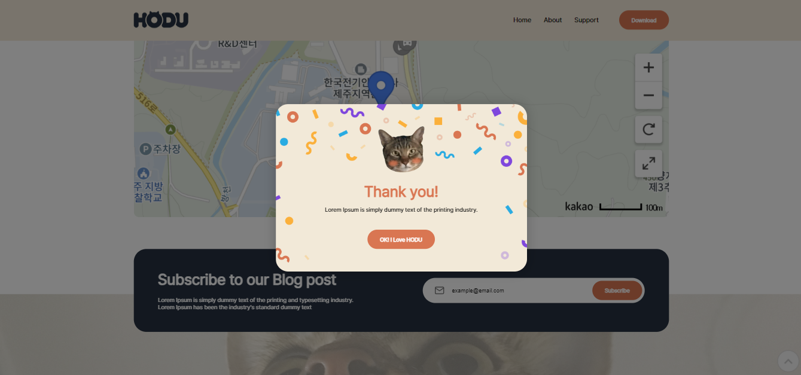

### 구독 모달 창 - 모바일

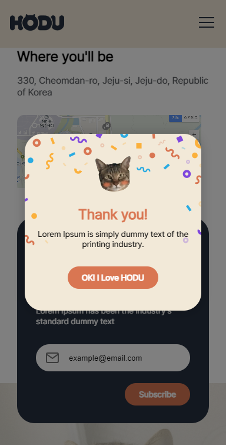
